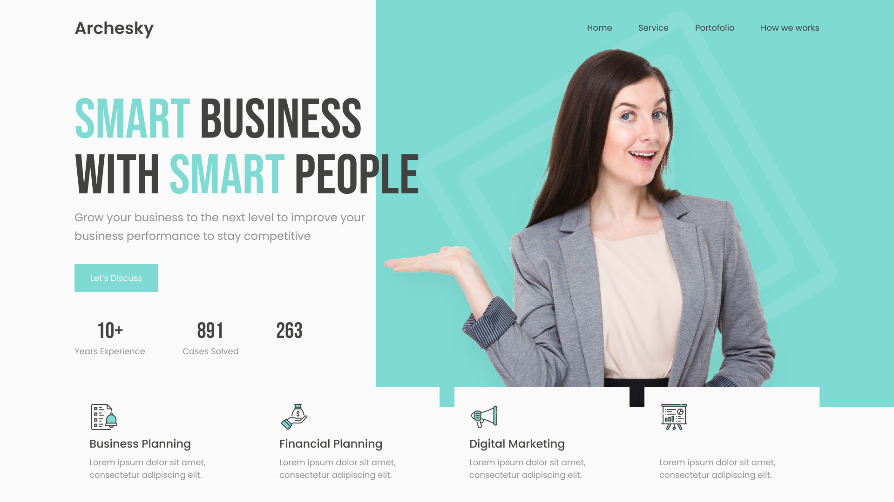

# HTML-CSS Header Business Agency

## Descripción del proyecto

En este repositorio encontrarás el encabezado de "Archesky", una agencia de negocios especializada en el desarrollo de planes de negocio, financiación y marketing digital. Con más de una década de experiencia en el mercado, se han consolidado como un socio estratégico para empresas que buscan crecer y optimizar sus operaciones.

El 'header' cuenta con logotipo y menú de navegación. La imagen de la modelo y el titular que la acompaña conforman la imagen corporativa y resumen de manera contundente la misión de "Archesky": <b>SMART BUSINESS WITH SMART PEOPLE</b>

## Vista previa del diseño
  
En la siguiente imagen se aprecia un detalle del resultado obtenido:

## Uso

Puedes reutilizar el código para tu propio proyecto web. Simplemente descárgate el repositorio y añádele los cambios necesarios para integrarlo en tu sitio.

## Contribuciones

¡Se aceptan contribuciones, claro que sí! Si encuentras algún problema o tienes alguna sugerencia de mejora, no dudes en ponerte en contacto conmigo y aportar tus ideas. Te lo agradeceré infinitamente :handshake:

